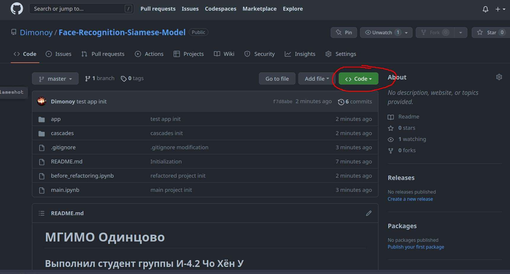
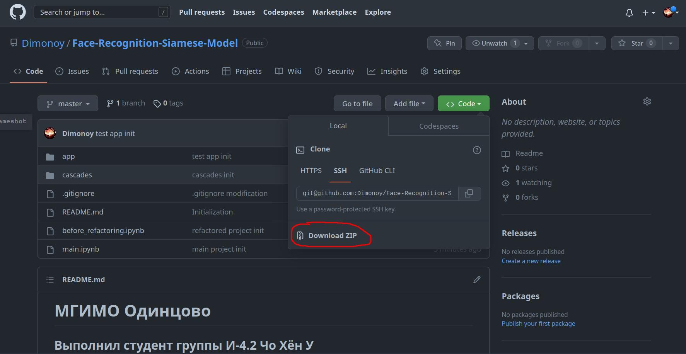

# МГИМО Одинцово
## Выполнил студент группы И-4.2 Чо Хён У

__E-mail__: h.cho@my.mgimo.ru

---

## Как скачать курсовую?

Нажмите на выпадающее окно 'Code'.

Нажмите на кнопку 'Download zip'. Готово!

Для запуска проекта необходимы следующие предуставновленные программы:
- Python 3.9>
- Jupyter Notebook/Lab
- Список модулей, перечисленных в первой ячейка файла 'main.ipynb'
